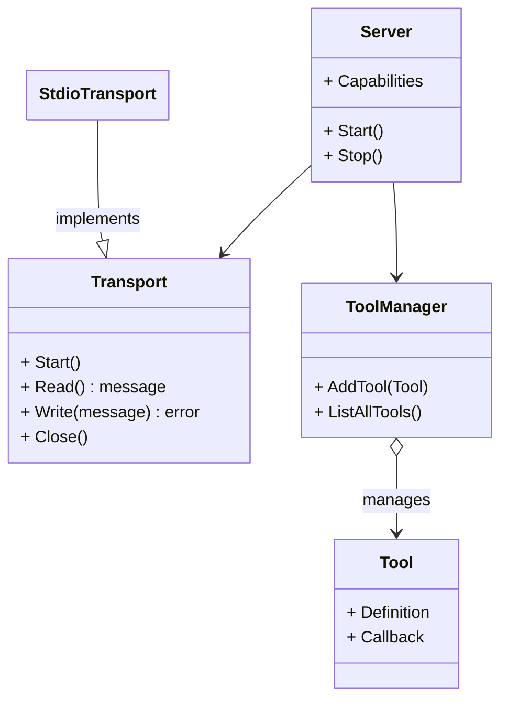

# Design

```mermaid
---
config:
  class:
    hideEmptyMembersBox: true
---
classDiagram
  Server  --> Transport
  Server --> ToolManager
  ToolManager o--> Tool: manages
  StdioTransport --|> Transport: implements

  class Transport {
    + Start()
    + Read() message
    + Write(message) error
    + Close()
  }

  class Tool {
    + Definition
    + Callback
  }

  class Server {
    + Capabilities
    + Start()
    + Stop()
  }

  class ToolManager {
    + AddTool(Tool)
    + ListAllTools()
  }
```
